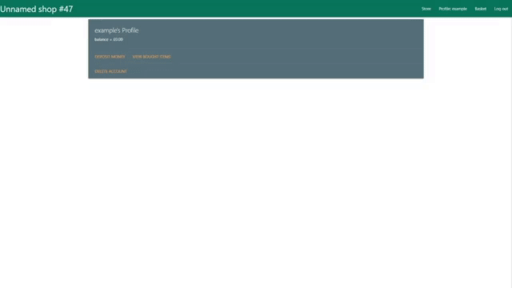
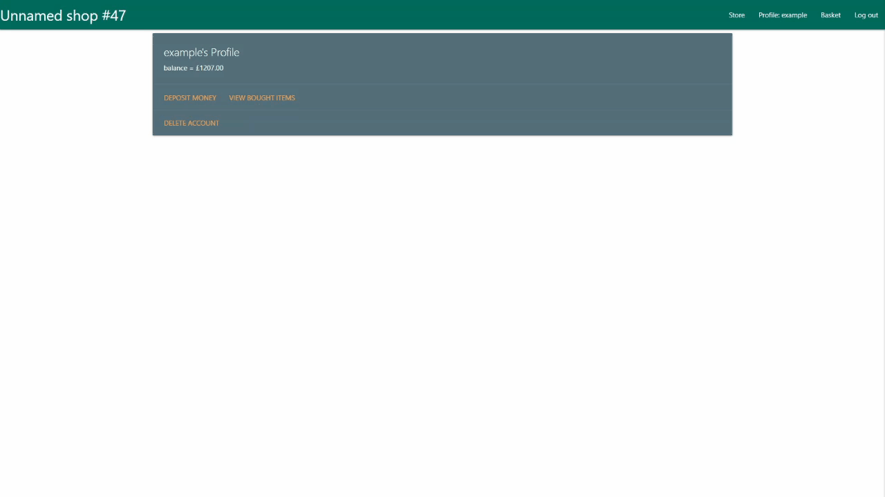

# Purpose of the Project :

Create a stock management website that makes use of a database to track how much of each item is in stock and track purchases made by individual users.

# Database Plan

stock:
-   name
-   type
-   cost
-   description
-   image_url
-   boughtBy
-   sold
users:
-   Name
-   password-hash
-   balance

stored on mongoDB - https://cloud.mongodb.com/v2/61139e25f0eba81f9f45682c#metrics/replicaSet/613f6895e52339380b7ad052/explorer/Stock/stock/find

Heroku app can be found here: https://backend-development-thingy.herokuapp.com/

# User Stories :

As a User:

- Want to be able to make an account

- Want to be able to view items that I have purchased

- Want to be able to deposit money into account so i can buy items

- Want to be able to delete my own account

- Want to be able to log in to my account at a later time

- Want to be able to log out of my account

- Want to be able to view all items in the store that i can buy

- Want to be able to pick items I want to buy

- Want to be able to buy items in basket

As an Admin:

- Want to be able to add items to the store that can be bought

- Want to be able to edit items after they have been put up in case something is wrong

- Want to be able to remove items from the store

- Want to be able to delete an arbritary account if there is some problem with it

# Features :

Look through all available products

Log in as a user, with a balance

option to purchase items now available

choose items from total list, can choose number wanted and add to basket

user can view selected basket as single list before making purchase

user can log out

user can view all previous purchases alongside when the purchase was made

# Future Features: 

# Typography and Color Scheme :

# Wireframes :

Generally simple, have a top bar to select each thing, updates dependent on if logged in or not. goes betweeen

Store, Log In, Create Account

to 

Store, Basket, Account, Log Out

based on log in

Account has a button for previous purchases, as well as just listing user details

# Current State :

# Testing
- Navigation

- Views

# Client Story Testing
As a User:

- Want to be able to make an account

Create Account 

Create Account invalid name and Create Account invalid password

Create Account that already exists

- Want to be able to view items that I have purchased

Click button with no items

Click button with 1 item

Click button with lots of items

- Want to be able to deposit money into account so i can buy items

Deposit 1

Deposit X

Deposit Pi

Deposit -1

- Want to be able to delete my own account

Delete account

- Want to be able to log in to my account at a later time

Log in with correct Password

log in with correct password but incorrect username

log in with correct password but incorrect password

log in with correct password for someones account but invalid name 

- Want to be able to log out of my account

Press Logout

- Want to be able to view all items in the store that i can buy

View Store, show things are locked off

- Want to be able to pick items I want to buy

Put item in shopping basket

Remove item from basket

Remove item from basket in basket view

- Want to be able to buy items in basket

Buy items in basket

Fail to afford items in basket

As an Admin:

- Want to be able to add items to the store that can be bought

Add item

Add item that matches description of other item

- Want to be able to edit items after they have been put up in case something is wrong

Edit item 

Edit item to invalid value

Remove purchaser

Add purchaser

- Want to be able to remove items from the store

Remove item

# Deployment

## How to run locally

## How to use the site

# Credits: 

LO1 Design, develop and implement a back-end for a full-stack web application using Python and a micro-framework

- 1.1	Design a front end for a data-driven web application that meets accessibility guidelines, follows the principles of UX design, meets its given purpose and provides a set of user interactions -
- 1.2	Implement custom HTML and CSS code to create a responsive full-stack application consisting of one or more HTML pages with relevant responses to user actions and a set of data manipulation functions -
- 1.3	Build a non-relational database-backed Flask web application that allows users to store and manipulate data records about a particular domain. -
- 1.4	Design a database structure that is relevant for your domain, consisting of a minimum of one collection. -
- 1.5	Design and implement manual test procedures to assess functionality, usability, responsiveness and data management within the Full Stack web application -
- 1.6	Write Python code that is consistent in style and conforms to the PEP8 style guide (or another explicitly mentioned style guide, such as Google's) and validated HTML and CSS code. =.
- 1.7	Include sufficient custom Python logic to to demonstrate your proficiency in the language -
- 1.8	Include functions with compound statements such as if conditions and/or loops in your Python code -
- 1.9	Write code that meets minimum standards for readability (comments, indentation, consistent and meaningful naming conventions). ..
- 1.10	Name files consistently and descriptively, without spaces or capitalisation to allow for cross-platform compatibility. -

LO2 Demonstrate competence in modeling and managing non-relational data effectively

- 2.1	Design a data model that fits the purpose of the project -
- 2.2	Develop the model into a usable non-relational database where data is stored in a consistent and well-organised manner. -

LO3 Demonstrate competence in querying and manipulating non-relational data effectively

- 3.1	Create functionality for users to create, locate, display, edit and delete records -

LO4 Deploy a full stack web application to a cloud platform

- 4.1	Deploy a final version of the full-stack application code to a cloud-based hosting platform (e.g. Heroku) and test to ensure it matches the development version 
- 4.2	Ensure that final deployed code is free of commented out code and has no broken internal links 
- 4.3	Document the deployment process in a README file in English that also explains the application’s purpose and the value that it provides to its users 

LO5 Identify and apply security features

- 5.1	Use Git & GitHub for version control of a Full Stack web application up to deployment, using commit messages to document the development process. -
- 5.2	Commit final code that is free of any passwords or security sensitive information, to the repository and to the hosting platform -
- 5.3	Use environment variables, or files that are in .gitignore, to hide all secret keys -
- 5.4	Ensure that DEBUG mode is turned off in production versions -