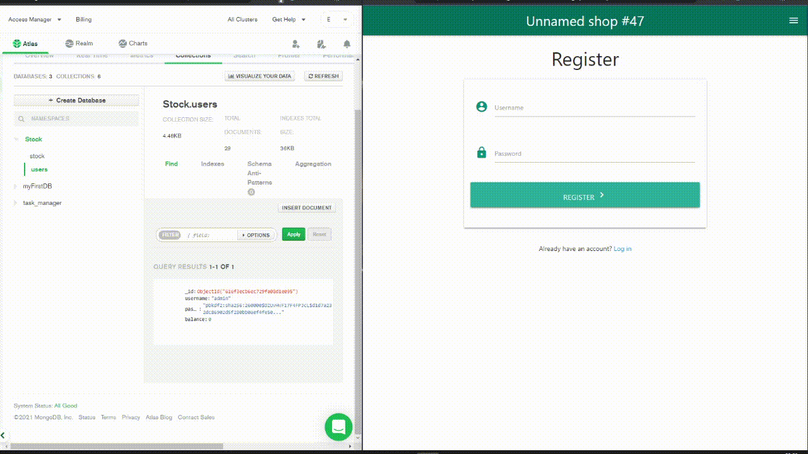
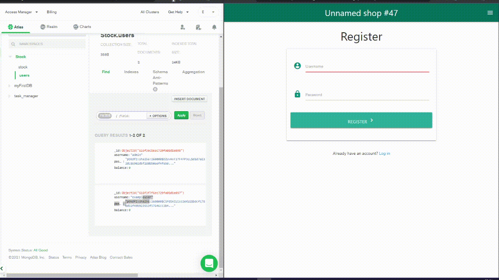
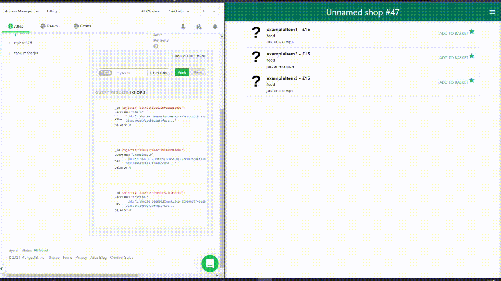
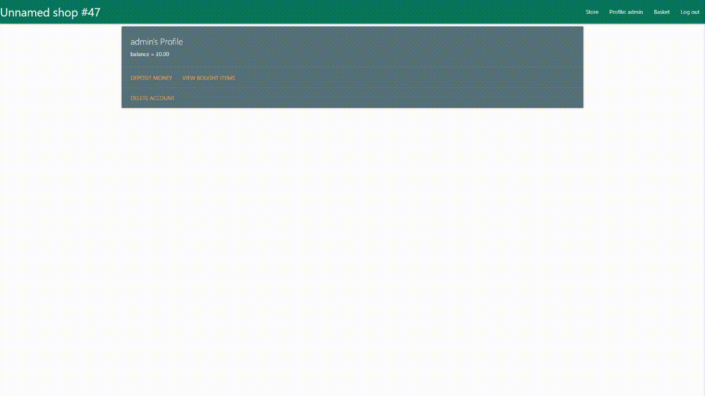
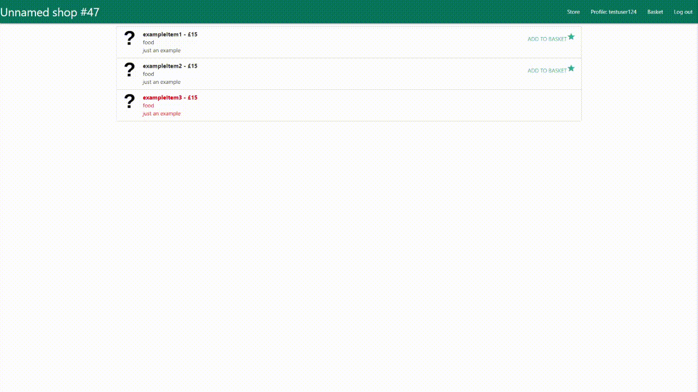
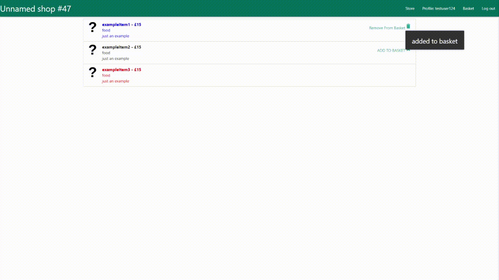
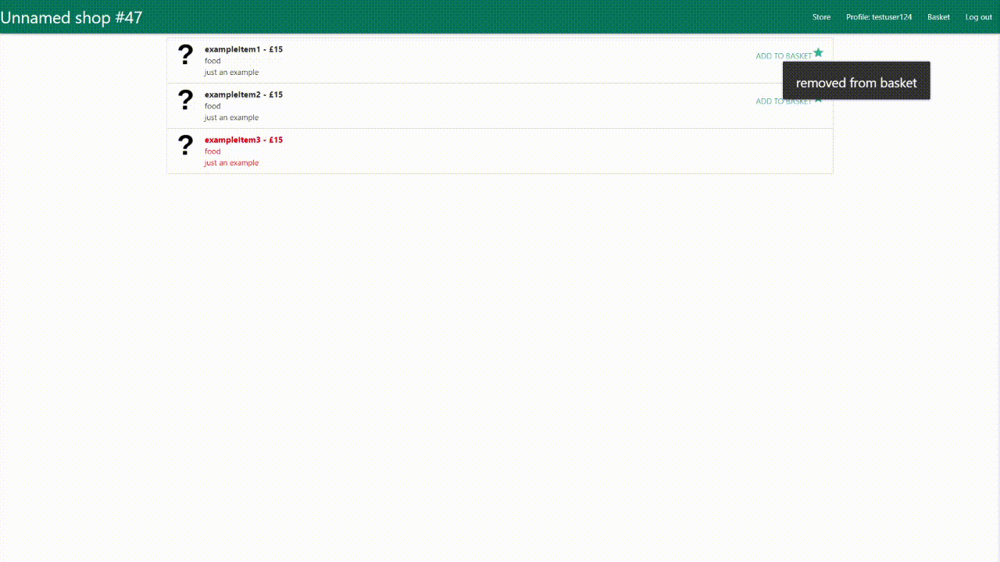
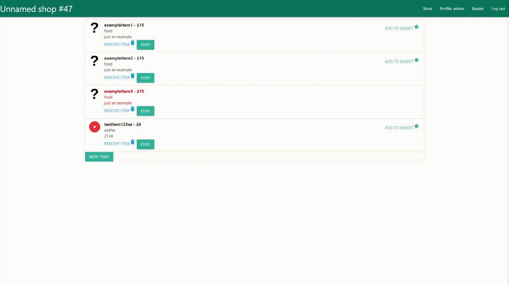

# Purpose of the Project :

Create a stock management website that makes use of a database to track how much of each item is in stock and track purchases made by individual users.

stored on mongoDB - https://cloud.mongodb.com/v2/61139e25f0eba81f9f45682c#metrics/replicaSet/613f6895e52339380b7ad052/explorer/Stock/stock/find

Heroku app can be found here: https://backend-development-thingy.herokuapp.com/

# Database Plan

stock:
-   name
-   type
-   cost
-   description
-   image_url
-   boughtBy
-   sold
users:
-   Name
-   password-hash
-   balance
One to many - each stock item can be bought by 1 and only 1 user, but each user can buy as many items as wanted

# User Stories :

As a User:

- Want to be able to make an account

- Want to be able to view items that I have purchased

- Want to be able to deposit money into account so i can buy items

- Want to be able to delete my own account

- Want to be able to log in to my account at a later time

- Want to be able to log out of my account

- Want to be able to view all items in the store that i can buy

- Want to be able to pick items I want to buy

- Want to be able to buy items in basket

As an Admin:

- Want to be able to add items to the store that can be bought

- Want to be able to edit items after they have been put up in case something is wrong

- Want to be able to remove items from the store

- Want to be able to delete an arbritary account if there is some problem with it

# Features :

Look through all available products

Log in as a user, with a balance

option to purchase items now available

choose items from total list, can choose number wanted and add to basket

user can view selected basket as single list before making purchase

user can log out

user can view all previous purchases alongside when the purchase was made

# Typography and Color Scheme :

using Materialize to create basic interaction, font etc will be default, teal will be used as main accent colour.

Each page will be either a single form to interact with or a list of items to pick between, both using Materialize Cards to make entry's look appealing.

# Client Story Testing
## As a User:

## Want to be able to make an account

- Create Account 

tests that creating an account that doesnt already exist works

<b>Works as intended</b> 

- Create Account with invalid name or invalid password 

tests that input validation works as intended rejecting invalid info

<b>Works as intended</b> 

- Create Account that already exists

tests that you can't create an account that matches another's username exactly

<b>Works as intended</b> 

## Want to be able to view items that I have purchased

- Click button with no items

Makes sure item view works when you have not yet bought an item

<b>Works as intended</b> 

- Click button with 1 item

tests that if you have one item, the list shows correctly

<b>Works as intended</b> 

- Click button with lots of items

tests that if you have multiple items, the list shows correctly

<b>Works as intended</b> 

## Want to be able to deposit money into account so i can buy items

- Deposit 1

Tests that you can input a deposit value and have it work

<b>Works as intended</b> 

- Deposit X

Tests that you can input a deposit with a decimal value

<b>Works as intended</b> 

- Deposit a floating point

Tests that you cant input a value thats precise to more than £0.01

<b>Works as intended</b> 

- Deposit -1

Tests that you cant deposit a negative value 

<b>Works as intended</b> 

## Want to be able to delete my own account

- Delete account

Tests that you can delete your account

<b>Works as intended</b> 

## Want to be able to log in to my account at a later time

- Log in with correct Password

Tests that with valid user info you can log in

<b>Works as intended</b> 

- log in with correct username but incorrect password

Tests that if you misstype your username then it doesnt log in

<b>Works as intended</b> 

- log in with correct password but incorrect username

Tests that if you misstype your password then it doesnt log in

<b>Works as intended</b> 

- log in with correct password for someones account but invalid name 

Tests that if you type a valid password to a different account it doesnt magically log into theirs

<b>Works as intended</b> 

## Want to be able to log out of my account

- Logout

Tests that logging out logs out

<b>Works as intended</b> 

## Want to be able to view all items in the store that i can buy

- View Store, show things are locked off

Just checks that store view works

<b>Works as intended</b> 

## Want to be able to pick items I want to buy

- Put item in shopping basket

Test that when you add an item to basket, it is no longer selectable and is marked as in basket

<b>Works as intended</b> 

- Remove item from basket

Tests that you can click an item in basket to remove it again

<b>Works as intended</b> 

- Remove item from basket in basket view

Test that from within basket view you can correctly interact with items in the basket

<b>Works as intended</b> 

## Want to be able to buy items in basket

- Buy items in basket

Test that you can buy items if your balance is high enough

<b>Works as intended</b> 

- Fail to afford items in basket

Test that when your balance isnt high enough to afford all items in basket, you cant buy

<b>Works as intended</b> 

## As an Admin:

## Want to be able to add items to the store that can be bought

- Add item

Test that you can add an item with arbritary values

<b>Works as intended</b> 

- Add item that matches description of other item

Test that you can add an item that perfectly matches another without having an error

<b>Works as intended</b> 

## Want to be able to edit items after they have been put up in case something is wrong

- Edit item 

Test that you can edit an item and have its changes save

<b>Works as intended</b> 

- Edit item to invalid value

Test that you cant edit an item to an invalid value 

<b>Works as intended</b> 

- Remove purchaser

Test that when you remove the purchaser from an item, it is no longer marked as bought and is purchasable again

<b>Works as intended</b> 

- Add purchaser

Test that you can add a purchaser and it locks off from buying it

<b>Works as intended</b> 

## Want to be able to remove items from the store

- Remove item

Test that you can delete an item from stock and have it removed entirely

<b>Works as intended</b> 

## Formatting tests

app.py follows PEP 8 style guide, tested using http://pep8online.com/ - returning "All right"

- Lighthouse tests 

# Deployment

This website is hosted on heroku and the database is stored in mongoDB. An account on both of these services is required to deploy your own version.

- Fork the project so you have your own version

## mongoDB steps

- Create a new cluster for your database, selecting provider/Region/tier as you want and give the DB a name

- Add 2 new Collections in the database, one names "users" and one named "stock" (or modify code as appropriate)

- Press the Databases button on the left of the site

- click the "Connect button" on your cluster and select "connect your application"

- select Database access and create a new root user with a password you decide on

- select python as your driver and copy the uri provided on this page for later use, modifying it to have the root password you specified above.

## Heroku steps

- Press the New Button at the top right of the Heroku dashboard

- Press "Create new app"

- Give the app a unique app name and a good region and create app

- On the page that opens, select Github in the "Deployment method" section

- Select your repo

- Go to Settings tab at the top of the page

- Go to the Config Vars section and press "Reveal Config Vars"

- Add a var for IP, MONGO_DBNAME, MONGO_URI, PORT and SECRET_KEY (URI selected from above, DBNAME as you named it, etc)

## My Upload

Heroku app can be found here: https://backend-development-thingy.herokuapp.com/

## How to run locally

# Credits: 

- 4.3	Document the deployment process in a README file in English that also explains the application’s purpose and the value that it provides to its users 
